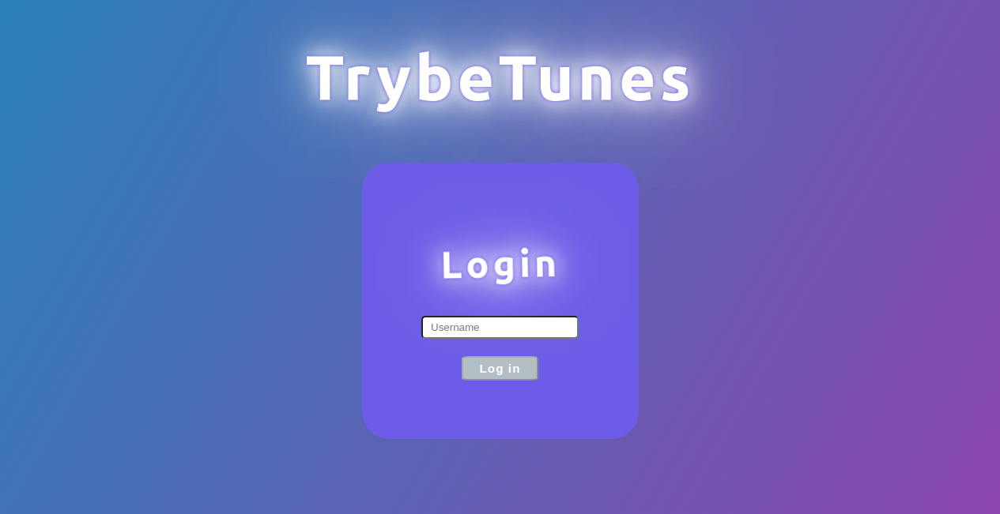
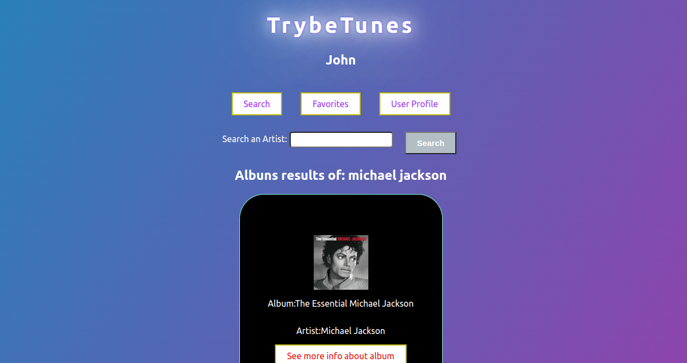
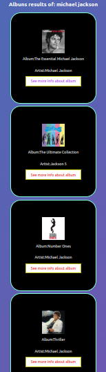
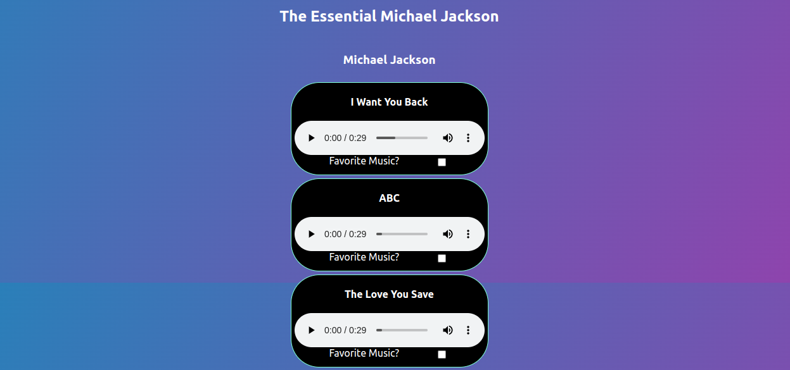

# 📻 Project-Tunes 🎶

<h2>English Version</h2>

<h1>🔊 Welcome to Project Tunes! 🎵</h1>

# Deploy:

https://front-end-project-tunes-production.up.railway.app/

This project is a front-end application that consumes an API of musics. The user will chose an artist, and the app will show and being able to reproduce some musics of that singer or band. It's also possible to create a favorite musicas list and edit the user's profile.

# Project Features:

  - Login;
  - Search for a band or artist;
  - List the available albums of that band or artist;
  - View the songs of a selected album;
  - Play a preview of the songs on this album;
  - Favorite and unfavorite songs;
  - View the list of favorite songs;
  - View the profile of the person logged in;
  - Edit the profile of the person logged in.

# Login Screen:

# Search for an artist (Michael Jackson) screen:

 

Some more Michael's albuns:

# Music Player:

# How to run:

Follow the steps below and listen to your favorite music! 😃

- git clone
- npm install
- npm start

<h1>🔊 Bem vindo ao Projeto Tunes! 🎵</h1>

# Deploy:

https://front-end-project-tunes-production.up.railway.app/

# Resumo do projeto:

O ProjectTunes é uma aplicação front-end que, ao consumir uma API, é capaz de reproduzir músicas das mais variadas bandas e artistas, criar uma lista de músicas favoritas e editar o perfil da pessoa usuária logada. A aplicação possui as seguintes funcionalidades:

  - Fazer login;
  - Pesquisar por uma banda ou artista;
  - Listar os álbuns disponíveis dessa banda ou artista;
  - Visualizar as músicas de um álbum selecionado;
  - Reproduzir uma prévia das músicas deste álbum;
  - Favoritar e desfavoritar músicas;
  - Ver a lista de músicas favoritas;
  - Ver o perfil da pessoa logada;
  - Editar o perfil da pessoa logada;
# Tela de Login:

# Tela de buscar artista (Michael Jackson):

 

mais alguns albuns de Michsael Jackson:

# Reprodutor de musicas:

# Como rodar o projeto:

Siga os passos abaixo e ouça sua música favorita! 😃

- git clone
- npm install
- npm start